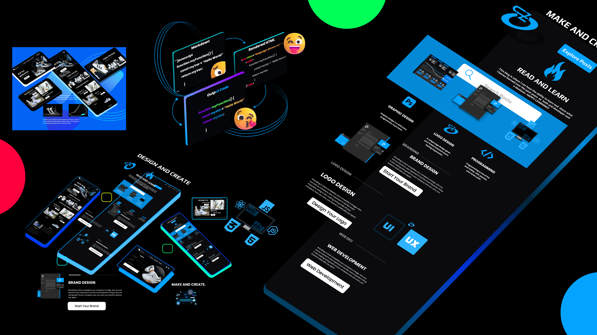

## Learn a bit about me here [About Sizo Mhlongo](https://www.sizodevelops.com/about)

## Check out this blog [Sizo Develops Blog](https://www.sizodevelops.com/blog)

# Also check out

## [<svg xmlns="http://www.w3.org/2000/svg" width="20" height="20" fill="currentColor" class="bi bi-linkedin" viewBox="0 0 16 16"><path d="M0 1.146C0 .513.526 0 1.175 0h13.65C15.474 0 16 .513 16 1.146v13.708c0 .633-.526 1.146-1.175 1.146H1.175C.526 16 0 15.487 0 14.854V1.146zm4.943 12.248V6.169H2.542v7.225h2.401zm-1.2-8.212c.837 0 1.358-.554 1.358-1.248-.015-.709-.52-1.248-1.342-1.248-.822 0-1.359.54-1.359 1.248 0 .694.521 1.248 1.327 1.248h.016zm4.908 8.212V9.359c0-.216.016-.432.08-.586.173-.431.568-.878 1.232-.878.869 0 1.216.662 1.216 1.634v3.865h2.401V9.25c0-2.22-1.184-3.252-2.764-3.252-1.274 0-1.845.7-2.165 1.193v.025h-.016a5.54 5.54 0 0 1 .016-.025V6.169h-2.4c.03.678 0 7.225 0 7.225h2.4z"/></svg> LinkedIn](https://www.linkedin.com/in/sizo-dev/)

## [<svg xmlns="http://www.w3.org/2000/svg" width="16" height="16" fill="currentColor" class="bi bi-google-play" viewBox="0 0 16 16"><path d="M14.222 9.374c1.037-.61 1.037-2.137 0-2.748L11.528 5.04 8.32 8l3.207 2.96 2.694-1.586Zm-3.595 2.116L7.583 8.68 1.03 14.73c.201 1.029 1.36 1.61 2.303 1.055l7.294-4.295ZM1 13.396V2.603L6.846 8 1 13.396ZM1.03 1.27l6.553 6.05 3.044-2.81L3.333.215C2.39-.341 1.231.24 1.03 1.27Z"/></svg> Google Play Store](https://play.google.com/store/apps/dev?id=6161771705630251284)

